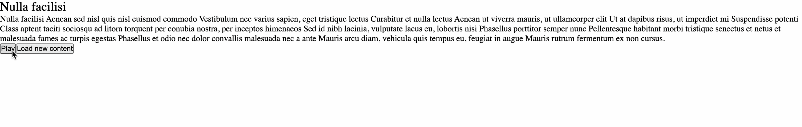

# Speechify Web Functional Test

## Project Overview

Create a TTS web app with indications for the current reading sentence, as well as the ability to highlight the currently playing word.

It should retrieve the SSML from an API (provided), synthesize it into sentences, and use our speech engine (provided) to implement the playback and UI.

---

## Task Details

### Implementation Checklist

-   [ ] **fetchContent:** Fetch content from the API end point using a GET request.
-   [ ] **parseContentIntoSentences:** Parse the fetched content into sentences based on rules described above (please refrain from using DOMParser or any built-in libraries to parse the fetched content)
-   [ ] **useSpeech:** Hook that takes the current set of sentences and plays it using the `speechEngine` in `speech.ts`
-   [ ] **UI:** A Controls component that allows you to play, pause and fetch new content. A Currently Reading component that displays the currently read sentence and word. (sentences should auto play after clicking play until paused)

### Parsing SSML

-   The API returns the content in form of an SSML string. This string will only contain a subset of SSML features: `<speak>`, `<p>`, `<s>`.
-   The assignment only requires focus on the `<s>`element which defines the beginning and the end of the sentences.
-   To complete this assignment, you must extract all the sentences from the SSML files ignoring everything else that is invalid.

Your parser implementation should have the same output as below:

```ts
/**
 * input: "<speak><s>This is a sentence.</s><s>This is another sentence</s></speak>",
 * sentences: ['This is a sentence.', 'This is another sentence']
 *
 * input: <speak><s>This is a sentence.</s><s>This is another sentence</s>Some more text</speak>
 * sentences: ['This is a sentence.', 'This is another sentence']
 *
 * input: <speak><s>This is a sentence.</s><s>This is another sentence</s>Some more text<s>This is a longer piece of content</s></speak>
 * sentences: ['This is a sentence.', 'This is another sentence', 'This is a longer piece of content']
 */
```

### Time to Implement

1 Hour 30 Minutes

---

## Setup

-   Clone the repository and run `npm install` to install the dependencies.
-   Run `npm run dev` to start the client development server.
-   Run `npm run dev:server` to start the API server.

### API

-   The code for the API is in the `api` directory. This piece is basically responsible for sending a random response from the array defined in `data.js`.
-   The api returns a response in form of a JSON object containing contents. The content string is in form of a subset of SSML that is defined later here.

### React App

-   The project is a basic react app, and such should come with all of the standard built ins of react.
-   Core logic for the project is hosted in `lib` folder.
-   `content.ts` file in the lib folder is responsible for fetching and parsing content into sentences.
-   `speech.ts` file contains an implementation for speech engine using the local window.speechSynthesis API.
-   `useSpeech.ts` reactifies the speech engine implementation and returns the controls for playback and gives information about the currently spoken word and sentence.

### Running Project Example



---

## Development Guidelines

### Do's

-   Write clean, maintainable, and well-documented code and follow the best practices and coding standards.
-   You are free to use any official documentation or language references (MDN, React Docs, etc).
-   You can use the debugging tools and native IDE features (only standard Auto-Completion)

### Don'ts

-   Do NOT use any external libraries for the implementation.
-   DO NOT use any Coding Assistants like GitHub Copilot, ChatGPT, etc or any other AI based tools.
-   DO NOT visit direct blogs or articles related to implementation of the tasks.
-   DO NOT use Stackoverflow or any other forum websites.
